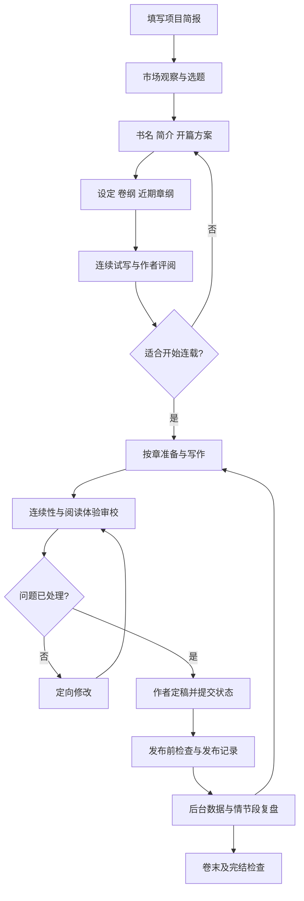

# 番茄长篇连载：Agent 辅助创作工作流

版本：1.0 · 建立日期：2026-09-30

适用：个人作者、一本中文长篇连载、作者主导与 Agent 辅助。流程可在普通文件夹中执行，无需先安装 GitHub 项目。短故事、完本签约需调整平台步骤后使用。

## 从这里开始

1. 阅读本页，使用 [开书流程](01-start.md) 完成立项、试写和连载准备。
2. 开书通过后，每章执行 [章节流程](02-chapter.md)。任务指令见 [Agent 任务卡](agent-tasks.md)。
3. 签约、推荐、发布或完结时，读取 [平台节点](03-platform.md)。
4. 每周、情节段结束或出现异常流失时，执行 [复盘流程](04-review.md)。

首次执行时，在仓库根目录创建 `books/<项目代号>/`。将 [项目模板](templates/project.md)、[账本模板](templates/ledgers.md)、[工作台模板](templates/control.md) 分别复制为项目内的 `project.md`、`ledgers.md`、`control.md`，填写已知内容。模板留在原处，项目数据写入项目目录。

每章将 [章节工作包](templates/chapter.md) 复制到 `chapters/0001/work.md` 等对应目录；正文单独保存为 `draft-v1.md`、`draft-v2.md`。通过定稿后保留作者认可版本为 `final-v1.md`，并在工作包中登记该文件。数字仅为示例。

## 总流程



## 分工

| 角色 | 主要责任 | 可修改内容 |
|---|---|---|
| 作者 / 主编 | 阅读承诺、人物与结局方向、风格、终稿和发布安排 | 全部创作决策 |
| 策划 | 市场资料、选题、卷纲、章卡 | 计划与备选；重大变更列为提案 |
| 写作 | 根据章卡和当前事实形成正文 | 当前草稿 |
| 审校 | 依据文本定位连续性及阅读问题 | 审校记录；修改交回写作步骤 |
| 记录与复盘 | 提取终稿变化、维护账本、解释真实数据 | 经核对的状态与复盘记录 |

角色是任务分工，可以由同一模型分阶段承担。审校使用独立上下文：读取稿件、章卡和证据，不读取写作过程中的自我辩护。启用并行 Agent 时，只有归档步骤更新正式账本。

## 四条执行约定

1. **事实有出处。** 已定稿正文决定故事已发生的事实；设定约束决定世界规则；两者冲突时先记录并处理冲突。未来计划和候选草稿不进入正史。
2. **审校对应版本。** 记录审校所用正文版本、章卡版本、账本版本。正文改变后，旧结论标为待复核。
3. **问题分级处理。** 硬性矛盾和阻断阅读的问题解决后进入定稿；审美建议由作者决定，不凑问题数量、不用单一分数代替判断。
4. **关键决定集中处理。** Agent 连续完成检索、草稿、审校和常规修订。作者在方向选择、重大改纲、终稿与发布节点审阅具体成果；已授权范围内的工作不反复询问。

## 可以直接使用的启动指令

```text
请按 workflow/README.md 执行番茄长篇连载工作流，先进行开书。
项目代号：<填写>
我的构想：<题材、人物、核心梗；暂时没有的写未定>
每日可投入时间：<填写>
请先创建项目文件，填写已知信息，列出缺少的关键选择。
完成独立可做的调研后，给我三个具体选题方案及一个推荐，等待我选择。
```

```text
继续 books/<项目代号>/，先读 control.md 的当前状态。
按 workflow/02-chapter.md 完成第 <N> 章的准备、写作、审校和最多两轮修订。
交付可审阅稿、问题处理记录和候选状态变化，供我定稿。
```

```text
我确认第 <N> 章 <具体文件及版本> 定稿。
请执行状态归档，核对本章带来的事实、人物知情和读者承诺变化，
更新 control.md 的下一步，然后准备下一章章卡。
```

以上是可复制的自然语言任务，不是已安装的命令。创建本工作流不等于启动小说生成或授权对外发布。

## 文件索引

| 文件 | 何时使用 |
|---|---|
| [01-start.md](01-start.md) | 开新书、重做定位、试写失败后调整 |
| [02-chapter.md](02-chapter.md) | 每章生产、修稿、定稿、恢复中断任务 |
| [03-platform.md](03-platform.md) | 签约、推荐、发布、福利和完结节点 |
| [04-review.md](04-review.md) | 每周、情节段结束、数据异常 |
| [agent-tasks.md](agent-tasks.md) | 为当前步骤分配任务与交付物 |
| [templates/project.md](templates/project.md) | 项目简报、市场观察、设定和大纲 |
| [templates/chapter.md](templates/chapter.md) | 单章任务、审校、定稿和状态变化 |
| [templates/ledgers.md](templates/ledgers.md) | 连续性与读者承诺记录 |
| [templates/control.md](templates/control.md) | 当前进度、发布记录、指标和复盘 |

设计依据及局限见 [番茄研究报告](../fanqie-agent-sop.md)。本流程吸收 novel-architect 的准备—写作—审校—提交思路及 NovelForge 的记忆预览思路，未安装或复制其程序。流程自身的审校不等于番茄平台审核。
